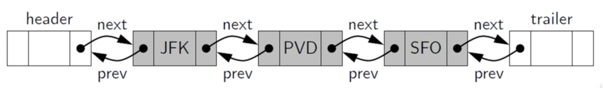
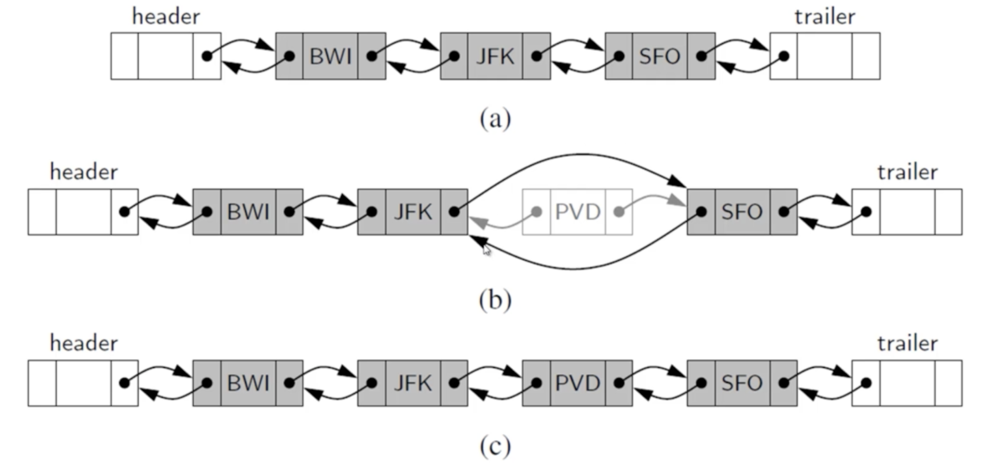
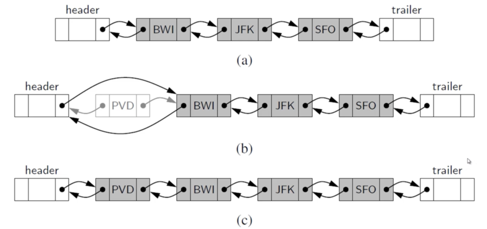
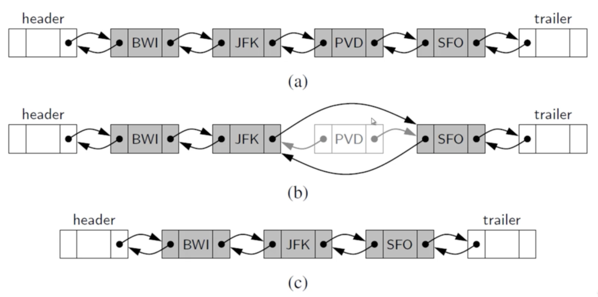

# Doubly Linked Lists

- In a doubly linked list, we define a linked list in which each node keeps an explicit reference to the node before it **and** a reference to the node after it.
- These lists allow a greater varitey of O(1)-time update operations, including insertions and deletions.
- We continue to use the term "next" for the reference to the node that follows anther.
- We have a new term "prev" for the reference to the node that precedes it.

### Sentinel Node

We add special nodes at both ends of the list

- a **header** node at the beginning of the list
- a **trailer** node at the end of the list.
- These ""dummy"" nodes are known as sentinels (or guards)

1. Every insertion into our doubly linked list reperentation will take place between a pair of existing nodes

2. When a new element is inserted at the front of the sequence, we will simply add the new node *between* the header and the node that is current after the header.

### Inserting and Deleting

(a) Beforethe operation

(b) After creating the new node

(c) After linking the neighbors to the new node

**Insertion of a Node to Front**

**Deletion of a Node**

- The two neighbors of the node to be deleted are linked directly to each other
- As a result, that node will № longer be considered part of the list and it can be reclaimed by the system.
- Because of sentinels, the same implementation can be used when deleting the first or the last element of a sequence.

